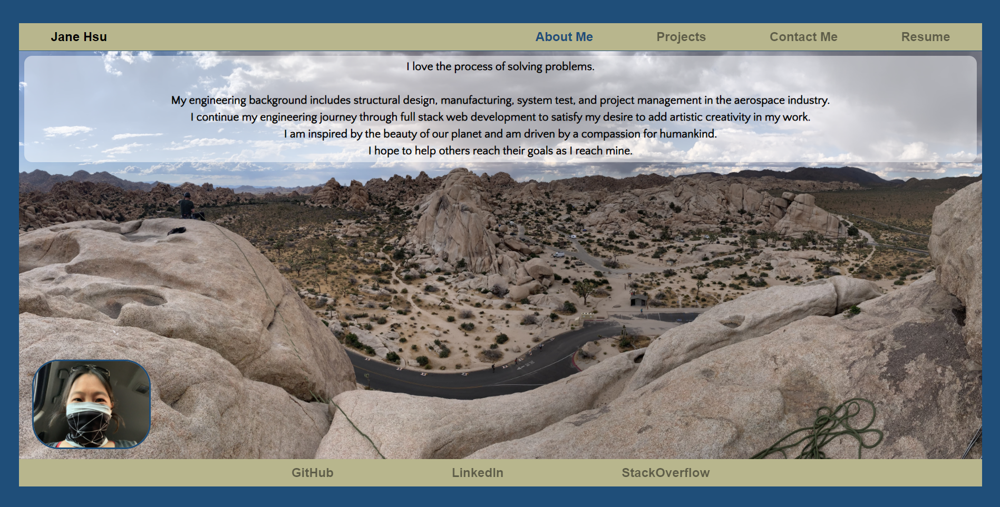

# React_Portfolio

## Table of Contents
* [Description](#description)
* [Installation](#installation)
* [Usage](#usage)
* [Contributing](#contributing)
* [Tests](#tests)
* [License](#license)
* [Questions](#questions)

## Description <a name="description"></a>
This is my portfolio and it includes ```About Me```, ```Projects```, ```Contact Me```, and ```Resume``` sections.  The portfolio also includes links to my GitHub, LinkedIn, and StackOverflow profiles.  The application was built using ```create-react-app``` and currently does not include a back-end.  The application utilizes FontAwesome for the GitHub icon and was styled completely in vanilla CSS.  Media queries are used for mobile responsiveness. 

## Installation <a name="installation"></a>
To use the code from this application, please do the following: 

1. Clone the application's respository from GitHub onto your local drive.  The GitHub URL is: https://github.com/plainjane99/React_Portfolio.

2. Set up the ```npm``` package by running the following command in the root directory of the application: 
    
    ```
    npm install
    ```
    
    This will download the application's dependencies into your root directory.  You should now have a folder called ```node_modules``` and a file called ```package-lock.json```.
3. A ```.gitignore``` file should be created if you intend to push your code to a repository.

## Usage <a name="usage"></a>

1. Once code installation is complete, run the application in development mode by typing the following into the command line at the root directory of the application:

    ```
    npm start
    ```
    
The application will start and open the application in your browser.    

2.  The live version of the application, aka my portfolio, is located at:  https://plainjane99.github.io/React_Portfolio/
The application should look like the following:



All projects in the ```Project``` section were developed through the UCLA Full Stack Web Development Extension Course.  I will be adding new projects once I have completed the UCLA course.

## Contributing <a name="contributing"></a>
Critiques are welcome!  Please contact me regarding improvements, questions, or comments.

## Tests <a name="tests"></a>
Jest can be used for application testing, however, no tests were created for this application.

## License <a name="license"></a>
This application is covered under the ISC license.

## Questions <a name="questions"></a>
My GitHub username is ```plainjane99```.  Please feel free to peruse my other projects.

If you have any questions regarding this application, please contact me via email at ```jane99hsu@gmail.com```.
  